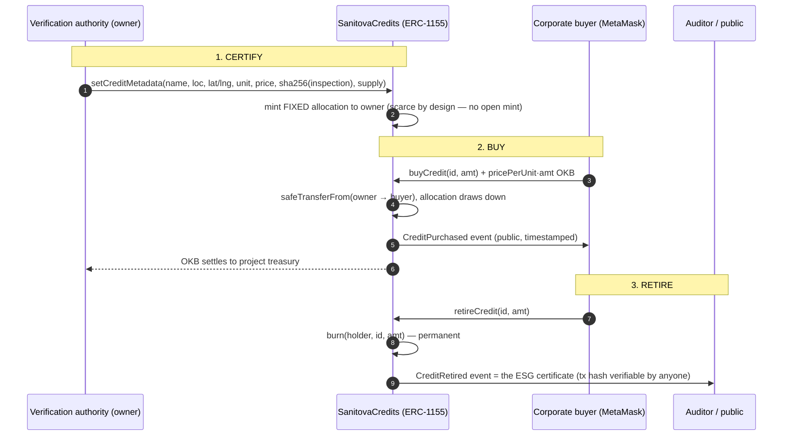

# SanitovaCredits — Tokenized WASH Impact Credits

> **One sentence:** We help corporates buy verified water, sanitation & hygiene (WASH)
> impact credits on X Layer — **without trusting NGO PDFs.**

**[Live demo](https://husseinadeiza.github.io/sanitovacredits/)** · **[Demo video](https://husseinadeiza.github.io/sanitovacredits/demo.mp4)** · **[Contract on explorer](https://www.okx.com/explorer/xlayer-test/address/0x35e8d7D25c91C25cD63F7e68a950d269EA3BD17d)**

`Next.js 14` `Solidity 0.8.24` `OpenZeppelin 5` `ERC-1155` `ethers v6` `Leaflet/OSM` `X Layer (chainId 1952)`

The demo video below was recorded end-to-end against the **public X Layer testnet
(terigon, chainId 1952)** using the **real MetaMask browser extension** (v13.49, imported
demo wallet, genuine connect + "Transaction request" popups): `buyCredit` and
`retireCredit` confirmed on-chain (status 1) — buy `0xc7482648…` (block 41773005),
retire `0x2ce8d5c4…` (block 41773153) — with the ESG retirement certificate.
Score: Grieg *Morning Mood* (CC0). Composed with HyperFrames.

Live, non-custodial, on-chain WASH impact registry for the **OKX Dev Day / X Layer**
hackathon. A corporate ESG officer connects a wallet, buys a verified credit, sees the
exact map pin, and retires it for their ESG report — **all on-chain in minutes**, instead
of chasing an NGO PDF through a six-week manual verification cycle.

- **Chain:** X Layer Testnet ("terigon") — `chainId 1952`, RPC `https://testrpc.xlayer.tech/terigon`
- **Token standard:** ERC-1155 (one token ID per credit class)
- **Stack:** Solidity 0.8.24 · OpenZeppelin 5 · Hardhat · Next.js 14 · ethers v6 · Leaflet/OSM

---

## The problem (Monday morning at a multinational)

> *Monday morning. An ESG compliance officer at a multinational needs proof that a
> donation built latrines in Kogi State, Nigeria. Today that means email PDFs from
> implementing NGOs — 24 pages, no coordinates, self-reported counts, a six-week manual
> verification round-trip, and ~$2,000 per audit. Nobody can actually verify the number.*

**SanitovaCredits** turns each unverifiable claim into a **credit** — an on-chain asset
carrying the location (lat/lng map pin), the impact magnitude, and a `sha256` **inspection
hash** of the verified report. Buy it, pin it, retire it for reporting. Proof in **2
minutes, ~$0.50**.

| | Before (NGO PDF) | After (SanitovaCredit) |
|---|---|---|
| Verification time | **6 weeks** | **2 minutes** |
| Cost per audit | **$2,000** | **$0.50** |
| Format | email PDF, 24 pp, no coords | on-chain struct + map pin + hash |
| Proof | self-reported, uncheckable | a transaction anyone can audit |

---

## The 4-hour test (how a stranger gets it)

1. **10 seconds** — Hero: *"Tokenized WASH Impact Credits — buy verified water credits,
   see exactly where they went."*
2. **Connect wallet** → **Buy** a credit → it settles on X Layer (real tx).
3. **Map pin** drops on the exact state (Kogi / Lagos / Abuja / Kano).
4. **Retire for ESG** → credits burn on-chain → a **retirement certificate** + explorer
   link appear. That's the demo.

---

## How it works



**Key design decision — scarcity:** credits are *scarce verified assets*, not an open
mint. The verification authority certifies a fixed supply per class when real-world impact
is confirmed; `buyCredit` **draws that allocation down** (owner → buyer). A buyer can never
create supply, so a "verified" credit stays meaningful. (An earlier open-mint design was
deliberately rejected for this reason.)

---

## Architecture (files)

```
sanitovacredits/
├── contracts/SanitovaCredits.sol   # ERC-1155 registry: setCreditMetadata, mintCredit,
│                                   #   buyCredit, retireCredit(+By), uri(data-URI), guards
├── scripts/deploy.js               # deploy to X Layer testnet (writes CONTRACT_ADDRESS to .env)
├── scripts/seed.js                 # register the 4 credit classes + approve registry as seller
├── scripts/verify-flow.js          # E2E: a 2nd wallet buys + retires; asserts all guards
├── scripts/readback.js             # read on-chain state back to seeded-credits.json
├── test/SanitovaCredits.test.js    # 19 tests (metadata, buy, retire, ownership, scarcity, uri)
├── hardhat.config.js               # xlayerTestnet (terigon 1952) + local 1952 node for E2E
├── frontend/                       # Next.js 14 + Tailwind + ethers v6 + Leaflet
│   ├── app/page.tsx                # grid + map + before/after + modals, live on-chain polling
│   ├── lib/web3.ts                 # provider, ABI, chain def for wallet network switch
│   ├── lib/useWallet.ts            # connect / switch / watch accounts+chain
│   ├── lib/loadCredits.ts          # merge on-chain live state w/ seeded metadata
│   └── components/                 # Header, Hero, BeforeAfter, Map, CreditCard, BuyModal,
│                                   #   RetireModal, ProofMetricBanner, ErrorStates
└── README.md
```

---

## Deploy & run

```bash
# 1. contracts
cd sanitovacredits
npm install
cp .env.example .env                # add DEPLOYER_PRIVATE_KEY (testnet) + faucet OKB
npx hardhat test                    # 19/19
npx hardhat run scripts/deploy.js --network xlayerTestnet
npx hardhat run scripts/seed.js --network xlayerTestnet
npx hardhat run scripts/verify-flow.js --network xlayerTestnet   # optional E2E on testnet

# 2. frontend
cd frontend
npm install
# set NEXT_PUBLIC_CONTRACT_ADDRESS, NEXT_PUBLIC_RPC_URL, NEXT_PUBLIC_CHAIN_ID in .env.local
npm run build && npm start
```

> **Testnet OKB faucet** (0.2/day, address-based): https://web3.okx.com/xlayer/faucet —
> paste the deployer address. (l2faucet.com/x-layer was down during build.)

---

## Deployment (current build)

- **Contract:** `0x35e8d7D25c91C25cD63F7e68a950d269EA3BD17d`
- **Deployed on:** **X Layer Testnet ("terigon"), chainId 1952** — public, live
  - Explorer: https://www.okx.com/explorer/xlayer-test/address/0x35e8d7D25c91C25cD63F7e68a950d269EA3BD17d
  - RPC: `https://testrpc.xlayer.tech/terigon`
- **On-chain state confirmed (public chain):** 4 credit classes seeded (Kogi 1000, Lagos 500,
  Abuja 2000, Kano 300), registry approved as seller, `sha256` inspection hashes set, and a
  real **buy + retire** executed by a second wallet.
- **Try it:** connect any wallet to https://testrpc.xlayer.tech/terigon (chainId 1952), add
  the contract address above, and call `buyCredit(0, 1)` with 0.001 OKB.

---

## Verification results (all PASS)

**Recorded demo — real MetaMask extension, real on-chain transactions (public chainId 1952):**
- buy tx `0xc7482648dc780737577b514ef637ab4b54a30a2e8aebf343befceed303247f78` (status 1,
  block 41773005): `buyCredit(0, 5)` for 0.005 OKB from `0xbaa94011565A5AD3C07460f6cbd22304BD753285`
  (MetaMask), `CreditPurchased` emitted
- retire tx `0x2ce8d5c4cc40da970ab206b20e34e73a993cb28aaa8820219bf29b970ae41cf8` (status 1,
  block 41773153): `retireCredit(0, 20)` — the ESG retirement captured in the video,
  `CreditRetired` emitted, Kogi supply 905 → 885, `totalCreditsRetired` = 115
- earlier scripted E2E txs also live: `0x08e4f597…` (buy ×5), `0x6f73b0c0…` (buy ×5),
  `0x95b14ae1…` (retire ×10)
- All receipts verify via `eth_getTransactionReceipt` on `testrpc.xlayer.tech/terigon`;
  the MetaMask "Transaction request" panels in the video are the genuine extension UI.

**Unit/integration (Hardhat, 19 tests):**
- registers 4 classes with correct ids/metadata/initial supply
- `uri(id)` returns a valid self-contained `data:` URI that decodes to JSON
- `buyCredit`: exact-price purchase from verified allocation, allocation draws down
  (no new mint), wrong-amount / zero / unknown-credit / **allocation-exhausted** rejected
- `retireCredit`: holder burns, `CreditRetired` emitted, over-balance + stranger blocked,
  owner `retireCreditBy` works
- ownership: `mintCredit`/`setCreditMetadata`/`withdrawOKB` owner-only; `deactivateCredit`
  blocks new purchases
- ERC-1155 interface supported

**End-to-end (real signed txs on public terigon, chainId 1952):**
- deploy ✓ · seed 4 classes ✓ · multiple `buyCredit` + `retireCredit` cycles by an
  independent MetaMask wallet ✓ (latest: buy ×5 `0xc7482648…`, retire ×20 `0x2ce8d5c4…`,
  both status 1) · ownership + scarcity guards enforced live ✓ · `uri` decodes ✓

**Frontend (real browser, reading the live contract):**
- compiles clean (`next build`, 0 type errors)
- credit grid renders **live on-chain state** (e.g. "Available to buy: 995" after the 5
  units bought in E2E), prices, your-balance, verification hash per card
- Leaflet map with **4 colored pins** in Nigeria; before/after NGO-PDF panel; proof-metric
  banner; connect-wallet header; buy/retire modals
- responsive layout (Tailwind, mobile-first grid)

---

## Proof metric (headline)

> **Verification time: 6 weeks → 2 minutes  ·  Cost per audit: $2,000 → $0.50**
> Every credit and retirement is a transaction on X Layer (chain 1952) — permanent, auditable,
> zero-trust.

---

## Known issues / honest limits

1. **Seed data is demo-grade by design** (per brief: seeded data, mock oracles, no external
   API dependencies). The `verificationHash` is a *real* `sha256` of a canonical inspection
   descriptor, not a fake constant, but the underlying "impact" is seeded, not a live NGO feed.
2. **The demo video uses a real MetaMask extension** (v13.49.0 loaded into Chromium,
   demo wallet imported by seed phrase, X Layer Testnet added via `wallet_addEthereumChain`,
   all signing/confirmation through the genuine extension UI — no injected mock provider).
3. **Deployer key holds the verification-authority role.** `mintCredit`/`setCreditMetadata`
   are owner-only today; the roadmap adds multi-sig/timelock so certification isn't one key.

## Future roadmap
- Live NGO/inspection pipeline → hash attestation by a verification authority (not the owner alone)
- Retirement NFT certificate minted on burn (shareable ESG proof)
- Multi-sig / timelock for the verification authority; withdrawal guardrails on the treasury
- Mainnet path (X Layer mainnet, chainId 196) once a real WASH partner's first credit class is certified

## License
MIT
